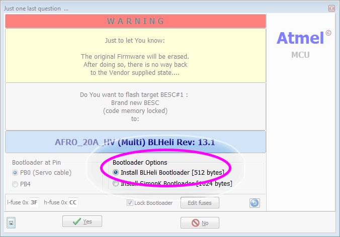
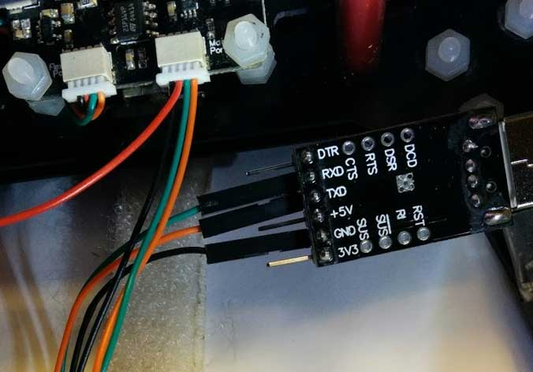

# 1-wire passthrough esc programming

### ESCs must have the BlHeli Bootloader.

If your ESCs didn't come with BlHeli Bootloader, you'll need to flash them with an ArduinoISP programmer first. [Here's a guide](http://bit.ly/blheli-f20).

This is the option you need to select for the bootloader:



Currently supported on the SPRACINGF3, STM32F3DISCOVERY, NAZE32 (including clones such as the FLIP32) and CC3D.

## Wiring

  - For the NAZE, no external wiring is necessary. Simply plugin the board via USB cable.

  - For the CC3D, connect [a USB to UART adapter](http://bit.ly/cf-cp2102) to the main port. If you need one, I prefer the [CP2102](http://bit.ly/cf-cp2102) as it is cheap and [the driver](https://www.silabs.com/products/mcu/Pages/USBtoUARTBridgeVCPDrivers.aspx) is readily available.

    - This is how you plug in the USB/UART adapter on the CC3D. Be sure to also plug in the normal USB cable as well.

    

  - In the case that your board does not power on fully without a battery attached, it is OK to attach the battery before following the steps below. However, it may not be necessary in all cases.

## Usage

How to for the CC3D: [https://youtu.be/fmUPL1lRcss](https://youtu.be/fmUPL1lRcss)

  - Plug in the USB cable and connect to your board with the CleanFlight configurator.

  - Open the CLI tab, then run: `1wire <esc index>`

    E.g. to connect to the ESC on your flight controller's port #1, run the command:

    ```
    1wire 1
    ```

  - Click "Disconnect" in the CleanFlight configurator. Do not power down your board.

    - Note, in the future it may be possible to configure your ESCs directly in CleanFlight.

  - Open the BlHeli Suite.

  - Ensure you have selected the correct Atmel or SILABS "(USB/Com)" option under the "Select ATMEL / SILABS Interface" menu option.

  - Ensure you have the correct port selected.

    - On the NAZE, this port will be the same COM port used by the CleanFlight configurator.

    - On the CC3D, this port will be your USB to UART serial adapter.

  - Click "Connect" and wait for the connection to complete. If you get a COM error, hit connect again. It will probably work.

  - Click "Read Setup"

  - Use BlHeli suite as normal.

  - When you're finished with one ESC, click "Disconnect"

  - Unplug the flight control board from Blheli.

    - On the CC3D this means you can unplug just the USB/UART adapter, leaving the USB cable attached. The advantage is that Cleanflight will stay connected and you'll only have to reconnect BlHeli.

    - On the NAZE you'll have to unplug USB cable and start over on the next ESC.

## Implementing and Configuring targets

The following parameters can be used to enable and configure this in the related target.h file:

    USE_SERIAL_1WIRE              Enables the 1wire code, defined in target.h


  - For new targets

    - in `target.h`

        ```
        // Turn on serial 1wire passthrough
        #define USE_SERIAL_1WIRE
        // How many escs does this board support?
        #define ESC_COUNT 6
        // STM32F3DISCOVERY TX - PC3 connects to UART RX
        #define S1W_TX_GPIO         GPIOC
        #define S1W_TX_PIN          GPIO_Pin_3
        // STM32F3DISCOVERY RX - PC1 connects to UART TX
        #define S1W_RX_GPIO         GPIOC
        #define S1W_RX_PIN          GPIO_Pin_1
        ```

    - in `serial_1wire.c`

       ```
       // Define your esc hardware
       #if defined(STM32F3DISCOVERY) && !(defined(CHEBUZZF3))
       const escHardware_t escHardware[ESC_COUNT] = {
         { GPIOD, 12 },
         { GPIOD, 13 },
         { GPIOD, 14 },
         { GPIOD, 15 },
         { GPIOA, 1 },
         { GPIOA, 2 }
       };
       ```

## Development Notes

On the STM32F3DISCOVERY, an external pullup on the ESC line may be necessary. I needed a 3v, 4.7k pullup.

## Todo

Implement the BlHeli bootloader configuration protocol in the CleanFlight GUI
